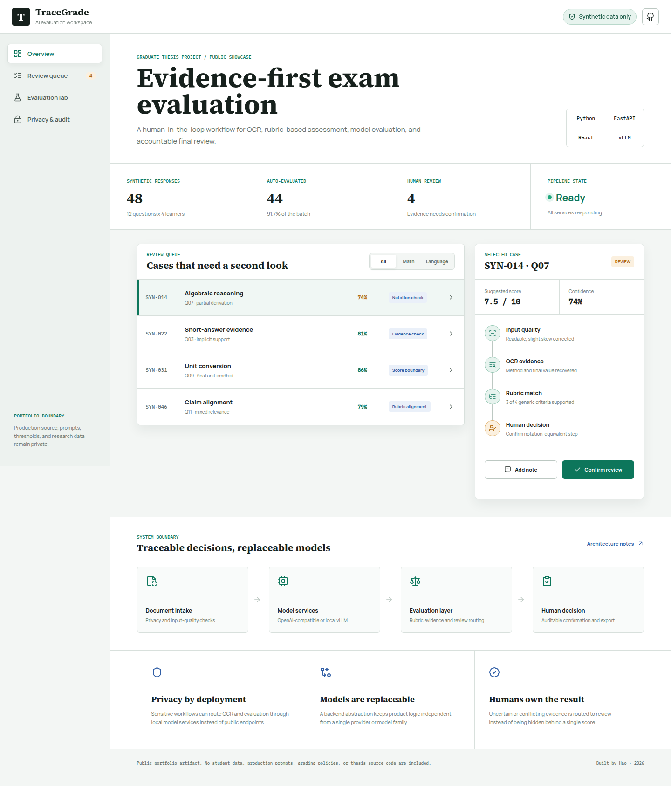
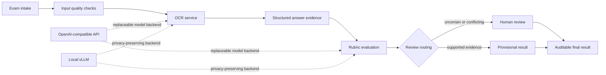

# TraceGrade

**A public portfolio showcase for a privacy-conscious, human-in-the-loop
AI exam evaluation system.**

[Open the interactive showcase](https://knightsccc.github.io/ai-exam-grading-showcase/)



> This is not the production or graduate thesis repository. It contains no
> student records, real exam content, production prompts, scoring policies,
> research datasets, deployment credentials, or private Git history.

## What this demonstrates

- End-to-end workflow design for document intake, OCR, rubric-based
  assessment, model evaluation, and human confirmation
- Python and FastAPI backend engineering
- React-based operational interfaces for repeated review work
- OpenAI-compatible model integration with optional local vLLM deployment
- Human-in-the-loop review, evidence tracing, audit logs, and export workflows
- Evaluation and regression practices supported by 90+ automated test modules
  in the private codebase

The interactive page uses only synthetic `SYN-*` cases.

## System design



The private implementation separates model access from product logic. This
allows OCR and evaluation services to switch between third-party compatible
APIs and local inference while preserving the same workflow contract.

## Engineering focus

### Evidence before automation

A model score is not treated as a sufficient explanation. The workflow keeps
input-quality findings, OCR evidence, criterion-level support, confidence, and
review reasons visible to the person making the final decision.

### Human ownership

Low-confidence and conflicting cases enter a review queue. Review decisions
are recorded as explicit events instead of silently overwriting model output.

### Privacy by deployment

Sensitive exam workflows can be restricted to local or private-network model
services. Public providers are replaceable rather than embedded in the
grading logic.

### Evaluation discipline

The private codebase includes teacher-calibrated samples, replay-based
comparison, failure taxonomy, holdout discipline, and automated regression
coverage. Detailed datasets, thresholds, and reports remain private while the
graduate thesis is in progress.

## Safe code sample

[`examples/evaluation_contract.py`](examples/evaluation_contract.py) provides
a small, generic Python contract for model assessments and review decisions.
It was written specifically for this public portfolio and contains no private
scoring logic.

Run its tests with:

```bash
python -m unittest discover -s tests -v
```

## Technology

| Area | Private implementation |
| --- | --- |
| Backend | Python, FastAPI |
| Frontend | React, TypeScript |
| Storage | SQLite / MySQL |
| AI integration | OpenAI-compatible APIs, local vLLM |
| Evaluation | Rubric evidence, replay analysis, human review |
| Delivery | Linux services, controlled local deployment |

## Resume summary

```text
AI-Powered Exam Grading System | Independent Graduate Thesis Project
Python, FastAPI, React, SQLite/MySQL, vLLM, LLM Evaluation

- Built an end-to-end OCR and LLM-assisted grading workflow covering document
  segmentation, recognition, rubric-based assessment, and human review.
- Designed evidence tracing and teacher-calibrated evaluation workflows for
  identifying uncertain, incomplete, or conflicting model outputs.
- Implemented a local privacy mode for processing sensitive exam data with
  on-premise vLLM services.
- Maintained 90+ automated test modules covering grading behavior, pipeline
  orchestration, data validation, and regression risk.
```

## Repository boundary

See [the public portfolio boundary](docs/portfolio-scope.md) and
[the copyright notice](NOTICE.md).

Copyright (c) 2026 Hao. All rights reserved.
