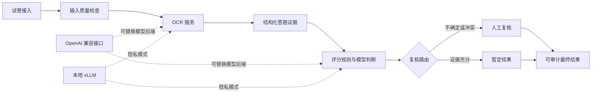

# TraceGrade 智能试卷批阅与大模型评测系统

**面向隐私敏感场景的 AI 智能阅卷公开展示，强调评分证据、人工复核和模型可替换性。**

[在线体验](https://knightsccc.github.io/ai-exam-grading-showcase/) ·
[English](README_EN.md)


> 本仓库不是生产项目或毕业论文源码。仓库不包含学生信息、真实试卷、生产提示词、具体评分策略、研究数据、部署凭据或私有 Git 历史。

## 项目展示内容

- 串联试卷接入、输入质量检查、OCR、评分规则、大模型判断和人工确认的端到端工作流
- 基于 Python、FastAPI 的后端工程实践
- 基于 React、TypeScript 的高频阅卷与复核操作台
- 同时支持第三方 OpenAI 兼容接口和本地 vLLM 模型服务
- 覆盖证据追踪、异常路由、人工复核、审计记录和结果导出
- 私有工程维护 90+ 个自动化测试模块，用于评分规则、任务编排、数据校验和回归检查

在线演示只使用 `SYN-*` 合成案例，不包含任何真实学生或试卷数据。

## 系统设计



私有工程将模型访问层与业务逻辑解耦。OCR 与评测服务可以在第三方兼容接口和本地推理服务之间切换，同时保持一致的业务流程契约。

## 工程重点

### 证据优先于自动化

模型给出的分数不被直接视为充分解释。系统保留输入质量、OCR 结果、评分点证据、置信度和复核原因，让教师能够查看分数依据。

### 最终结果由教师确认

低置信度、格式异常和证据冲突的记录进入复核队列。人工决策以明确的审计事件保存，而不是直接覆盖模型输出。

### 通过部署方式保护隐私

敏感试卷的 OCR 和评测任务可以限制在本地或内网模型服务中。公共模型接口是可替换后端，不与评分业务逻辑绑定。

### 可复现的模型评测

私有工程包含教师确认样本、离线重放、模型对比、失败分类、留出集评测和自动化回归检查。毕业设计进行期间，详细数据集、阈值和实验报告保持私有。

## 脱敏代码示例

[`examples/evaluation_contract.py`](examples/evaluation_contract.py) 提供一个精简、通用的 Python 评测结果与人工复核契约。该文件专门为公开展示编写，不包含私有评分逻辑。

运行测试：

```bash
python -m unittest discover -s tests -v
```

## 技术栈

| 方向 | 私有工程实现 |
| --- | --- |
| 后端 | Python、FastAPI |
| 前端 | React、TypeScript |
| 数据存储 | SQLite / MySQL |
| 模型接入 | OpenAI 兼容接口、本地 vLLM |
| 评分与评测 | 评分点证据、离线重放、人工复核 |
| 部署 | Linux 服务、受控本地部署 |

## 简历项目描述

```text
智能试卷批阅与大模型评测系统｜独立毕业设计项目
Python、FastAPI、React、SQLite/MySQL、vLLM、大模型评测

- 构建覆盖试卷切分、OCR、评分规则、大模型辅助判断与人工复核的端到端工作流。
- 设计评分证据追踪和教师确认样本评测流程，识别不确定、不完整或相互冲突的模型输出。
- 实现本地隐私模式，通过本地 vLLM 服务处理敏感试卷数据。
- 维护 90+ 个自动化测试模块，覆盖评分行为、任务编排、数据校验和回归风险。
```

## 公开边界

详细范围见[公开项目边界](docs/portfolio-scope.md)和[版权说明](NOTICE.md)。

Copyright (c) 2026 Hao. All rights reserved.
